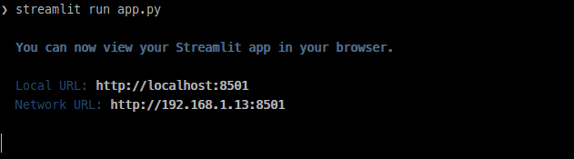
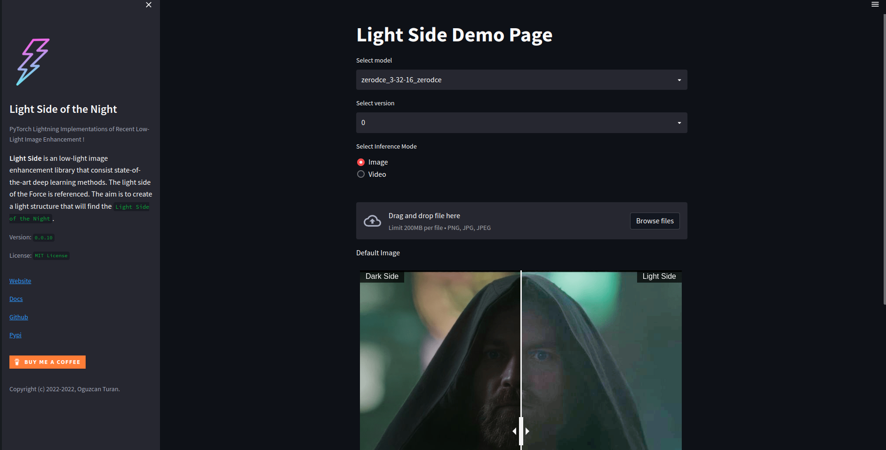
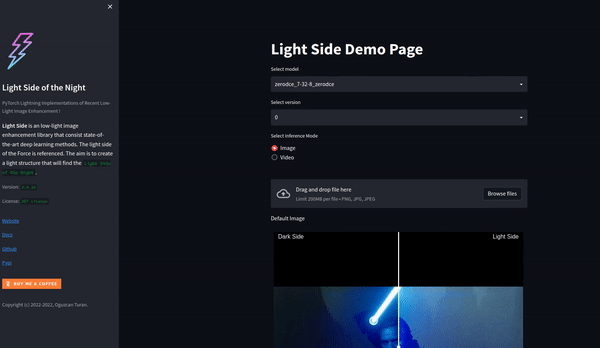

<p align="right">
    <a href="https://www.buymeacoffee.com/canturan10"></a>
</p>

<!-- PROJECT SUMMARY -->
<p align="center">
    
<h2 align="center">Light Side | Streamlit</h2>
<h4 align="center">Implementation of Streamlit Library for Light Side</h4>

<p align="center">
    <strong>
        <a href="https://canturan10.github.io/light_side/">Website</a>
        •
        <a href="https://light-side.readthedocs.io/">Docs</a>
        •
        <a href="https://pypi.org/project/light-side/">Pypi</a>
    </strong>
</p>
<p align="center">
    <strong>
        <a href="https://huggingface.co/spaces/canturan10/light_side"></a>
    </strong>
</p>

<p align="center">
    
</p>

<!-- ABOUT THE PROJECT -->
## About The Light Side | Streamlit

**Light Side | Streamlit** is a web application that is developed with the Streamlit library. With "Light Side | Streamlit", you can easily enhance  dark images to light images.

<!-- PREREQUISITES -->
## Prerequisites

Before you begin, ensure you have met the following requirements:

| requirement       | version  |
| ----------------- | -------- |
| light_side| 0.0.10|
| opencv-python-headless| 4.6.0.66|
| streamlit-image-comparison| 0.0.2|
| streamlit| 1.11.1|

<!-- INSTALLATION -->
## Installation

To install `Light Side | Streamlit`, follow these steps:

### Install Requirements

```bash
pip install -r  requirements.txt
```

### Run Streamlit

```bash
streamlit run app.py
```

<!-- SCREENSHOTS -->
## Screenshots

<table style="width:100%">
    <tr>
        <td align="center">
            <p>
                <strong>
                    When launching the Streamlit application
                </strong>
            </p>
            <br>
        </td>
    </tr>
    <tr>
        <td align="center">
            <p>
                <strong>
                    View of our Streamlit app in your browser
                </strong>
            </p>
            <br>
        </td>
    </tr>
    <tr>
        <td align="center">
            <p>
                <strong>
                    You can swipe through the results and analyze many models and versions
                </strong>
            </p>
            <br>
        </td>
    </tr>
</table>

<!-- APIs -->

<!-- LICENSE -->
## License

This project is licensed under `MIT` license. See [`LICENSE`](LICENSE) for more information.

<!-- REFERENCES -->
## References

The references used in the development of the project are as follows.

- [Light Side of the Night](https://github.com/canturan10/light_side)
- [Streamlit Image Comparison Component](https://github.com/fcakyon/streamlit-image-comparison)
- [Streamlit](https://streamlit.io/)

<!-- CITATIONS -->
## Citations

<details>
  <summary>Click to expand!</summary>

```bibtex
@misc{Turan_light_side,
author = {Turan, Oguzcan},
title = {{light_side}},
url = {https://github.com/canturan10/light_side}
}
```

</details>


Give a ⭐️ if this project helped you!
